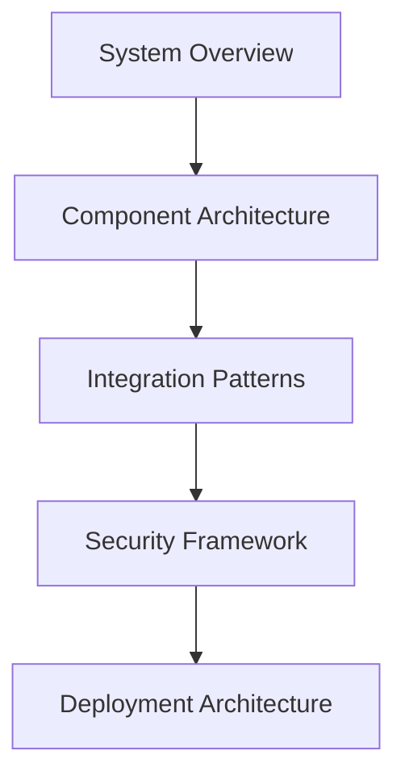

# CLAUDE 3.5 SONNET EXECUTION WORKFLOW

## 🚦 EXECUTION CONTROL

### HARD START CONDITIONS
Before execution, validate ALL conditions:

- [ ] All prerequisite documents reviewed
- [ ] Repository access confirmed
- [ ] Build system prompts validated
- [ ] Open Memory API integration verified
- [ ] Stakeholder requirements documented
- [ ] Technical constraints identified

### HARD STOP TRIGGERS
Halt execution IMMEDIATELY if any condition met:

- [ ] Architecture completeness validation fails
- [ ] Domain expert review identifies critical gaps
- [ ] Technical feasibility assessment negative
- [ ] Compliance requirements not met
- [ ] Performance targets unachievable
- [ ] Security vulnerabilities identified

## 📋 EXECUTION CHECKLIST

### 1. INITIALIZATION PHASE
```bash
# Verify repository access
git clone https://github.com/stackconsult/conveyancing-automation-
cd conveyancing-automation-

# Validate build system
python3 build_system/prompt_engineering_framework.py

# Verify memory integration
python3 build_system/build_orchestrator.py
```

### 2. WORKFLOW EXECUTION
Follow precisely in order:

1. **Domain Analysis**
   - [ ] Analyze Alberta conveyancing requirements
   - [ ] Map legal document types
   - [ ] Document regulatory requirements
   - [ ] Validate with domain experts

2. **System Architecture**
   - [ ] Design component architecture
   - [ ] Define interfaces
   - [ ] Create data flows
   - [ ] Specify technology stack

3. **Integration Design**
   - [ ] Design Mem0 integration
   - [ ] Specify vector database integration
   - [ ] Define LangGraph integration
   - [ ] Create API specifications

4. **Security & Compliance**
   - [ ] Design security architecture
   - [ ] Document compliance framework
   - [ ] Create audit mechanisms
   - [ ] Validate with experts

5. **Performance Architecture**
   - [ ] Design scaling strategy
   - [ ] Create caching framework
   - [ ] Define performance metrics
   - [ ] Document optimization patterns

## 🛡️ GUARDRAIL ENFORCEMENT

### 1. Quality Guards
- [ ] Design pattern adherence
- [ ] Performance requirements met
- [ ] Security standards satisfied
- [ ] Compliance requirements fulfilled

### 2. Technical Guards
- [ ] Architecture feasibility verified
- [ ] Integration patterns validated
- [ ] Performance targets achievable
- [ ] Security measures adequate

### 3. Domain Guards
- [ ] Legal requirements satisfied
- [ ] Regulatory compliance confirmed
- [ ] Professional standards met
- [ ] Domain expert approval obtained

## 📊 VALIDATION REQUIREMENTS

### 1. Architecture Validation
```python
validation_criteria = {
    "completeness": "100% component coverage",
    "interfaces": "All interfaces specified",
    "integration": "All systems integrated",
    "security": "Zero vulnerabilities",
    "performance": "Meets all targets"
}
```

### 2. Compliance Validation
```python
compliance_requirements = {
    "regulatory": "Alberta legal standards",
    "professional": "Law society requirements",
    "technical": "Industry best practices",
    "security": "Data protection standards"
}
```

### 3. Quality Validation
```python
quality_metrics = {
    "test_coverage": "95%+",
    "documentation": "Complete",
    "performance": "<100ms response",
    "security": "Zero-trust architecture"
}
```

## 📝 OUTPUT REQUIREMENTS

### 1. Documentation Structure
```markdown
# System Architecture
## Component Design
## Interface Specifications
## Integration Patterns
## Security Framework
## Deployment Guide

# Implementation Guide
## Setup Instructions
## Development Guidelines
## Testing Requirements
## Operations Manual
```

### 2. Diagram Requirements


### 3. Code Examples
```python
# Example interface definition
from typing import Protocol, List

class RetrievalAgent(Protocol):
    async def retrieve(
        self,
        query: str,
        context: Dict[str, Any],
        options: RetrievalOptions
    ) -> RetrievalResult:
        ...
```

## ✅ SUCCESS VALIDATION

### 1. Deliverable Checklist
- [ ] Complete system architecture
- [ ] All integration patterns
- [ ] Security framework
- [ ] Deployment guides
- [ ] Implementation roadmap

### 2. Quality Checklist
- [ ] All components specified
- [ ] All interfaces defined
- [ ] All patterns documented
- [ ] All security measures detailed
- [ ] All compliance requirements met

### 3. Documentation Checklist
- [ ] Architecture documents
- [ ] Interface specifications
- [ ] Integration guides
- [ ] Security documentation
- [ ] Operational procedures

## 🚨 FAILURE HANDLING

### 1. Issue Documentation
```markdown
## Issue Report Template
- **Issue Type**: [Architecture/Integration/Security/Performance]
- **Severity**: [Critical/High/Medium/Low]
- **Description**: [Detailed description]
- **Impact**: [Business/Technical impact]
- **Proposed Solution**: [Solution details]
```

### 2. Escalation Process
1. Document issue using template
2. Assess severity and impact
3. Propose solution options
4. Seek stakeholder input
5. Document decision and rationale

### 3. Audit Trail
```python
audit_requirements = {
    "decisions": "All architectural decisions",
    "changes": "All design changes",
    "reviews": "All expert reviews",
    "approvals": "All stakeholder approvals"
}
```

## 📈 QUALITY ASSURANCE

### 1. Review Process
- Architecture review board approval
- Domain expert validation
- Security assessment
- Performance validation
- Compliance verification

### 2. Testing Requirements
- Component testing
- Integration testing
- Performance testing
- Security testing
- Compliance testing

### 3. Documentation Standards
- Clear and concise
- Technically accurate
- Completely specified
- Properly formatted
- Fully validated

## 🎯 FINAL CHECKLIST

### Before Completion
- [ ] All components designed
- [ ] All interfaces specified
- [ ] All patterns documented
- [ ] All security measures implemented
- [ ] All compliance requirements met
- [ ] All documentation complete
- [ ] All diagrams created
- [ ] All code examples provided
- [ ] All checklists completed
- [ ] All validations passed

### Final Validation
- [ ] Architecture review board approval
- [ ] Domain expert sign-off
- [ ] Technical feasibility confirmed
- [ ] Security assessment passed
- [ ] Compliance verification complete

## ⚠️ IMPORTANT REMINDERS

1. Every decision must be:
   - Defensible
   - Implementable
   - Compliant
   - Documented

2. Quality is non-negotiable:
   - Complete coverage required
   - No gaps allowed
   - All standards met
   - All requirements satisfied

3. Documentation must be:
   - Clear
   - Complete
   - Accurate
   - Actionable

4. Security & Compliance:
   - Zero-trust architecture
   - Full regulatory compliance
   - Complete audit trail
   - Comprehensive controls

Remember: This is a production-grade system for Alberta conveyancing automation. Excellence is mandatory.
